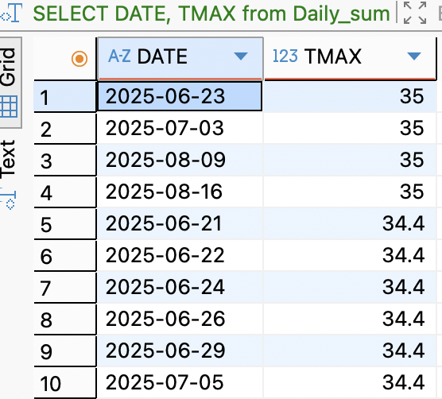
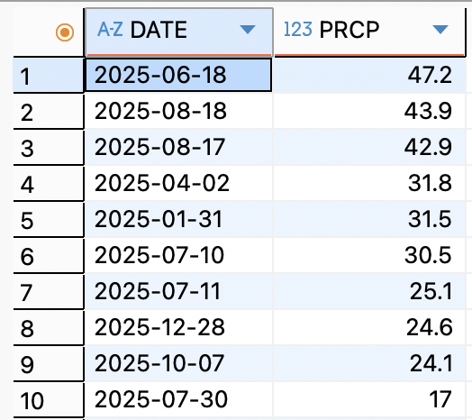
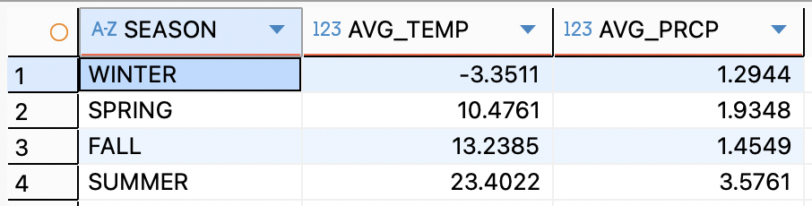

# Chicago Weather Seasonality Analysis (SQL)
**Author**:Barbie Jindal  
**Tools:** SQL (SQLite), DBeaver  
**Data Source:** NOAA Climate Data Online – Daily Summaries  
**Location:** Chicago O’Hare International Airport  
**Time Period:** January 1, 2025 – December 31, 2025  

# Project Overview 
This project analyzes seasonal temperature and precipitation patterns in Chicago using real-world NOAA daily weather data.  
The objective is to understand how weather conditions vary across seasons and identify patterns relevant to climate analysis and outdoor activity planning.

# Research Questions
1. What were the highest daily maximum temperatures during summer months and the lowest daily minimum temperatures during winter months in 2025?
2. On which day did the highest amount of precipitation occur, and how much rainfall was recorded?
3. Which month had the highest average temperature?
4. Which month had the lowest average temperature?
5. How do temperature and precipitation patterns differ across the four seasons?
6. Which months show the most favorable weather conditions for outdoor activities?

# Dataset Description
- **Granularity:** Daily observations (1 row = 1 day)
- **Station:** Chicago O’Hare International Airport
- **Units:** Temperature (°C), Precipitation (mm)
- **Time period** 2025-01-01 to 2025-12-31
- **Key Variables:**  
  1.'TMAX' – Maximum daily temperature  
  2.'TMIN' – Minimum daily temperature  
  3.'TAVG' – Average daily temperature  
  4.'PRCP' – Daily precipitation

# Key Findings
- Summer months, particularly, **June** recorded the highest daily maximum temperatures, approximately 35° celcius on multiple days. 
- Winter showed extreme cold conditions, with the lowest temperatures,least dropping to —22.1° celcius occurring in **January**.
- The highest precipitation event occurred on a single summer day, indicating episodic heavy rainfall during the summer season.
- Among the fall months, September showed moderate temperatures and lower precipitation levels, suggesting optimal weather conditions for outdoor activities.

# Skills Demonstrated
- Data acquisition from public government sources (NOAA Climate Data Online)
- SQL-based data aggregation and summarization
- Time-based analysis using 'strftime'
- Seasonal feature engineering using 'CASE' statements
- Exploratory and descriptive analysis of real-world climate data
- Analytical interpretation of temperature and precipitation patterns

# Results Summary 
- **Maximum summer temperature:** 35 °C, observed on multiple days across June, July, and August
- **Minimum winter temperature:** −22.1 °C, recorded on January 21, 2025
- **Highest single-day rainfall:** 47.2 mm on June 18, 2025
- **Warmest month (average temperature):** July (25.26 °C)
- **Coldest month (average temperature):** January (−4.9 °C)
- **Most favorable season for outdoor activity:** Fall, particularly September, due to moderate temperatures and relatively low precipitation

# Screenshots
Each result is supported by query output screenshots from DBeaver.

# Maximum Summer Temperature (TMAX)

# Minimum Winter Temperature (TMIN)

# Highest Single-Day Precipitation (PRCP)

# Month with Highest Average Temperature (TAVG)

# Month with Lowest Average Temperature (TAVG)

# Seasonal Average Temperature & Precipitation

